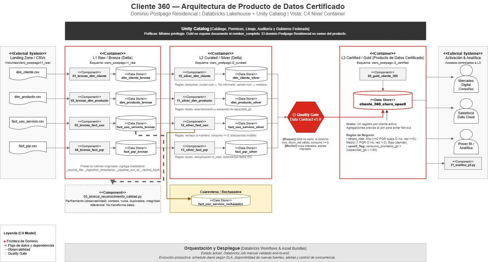

# Cliente 360 — Riesgo de Churn y Oportunidad de Upsell


Prueba técnica para el cargo de Ingeniero(a) Data Mesh en Claro Colombia.


## Descripción


Pipeline batch que construye un producto de datos certificado (L3) para el dominio Postpago Residencial. Integra cuatro fuentes:


- `dim_cliente`: maestro de clientes.
- `dim_producto`: catálogo de productos.
- `fact_uso_servicio`: consumo mensual.
- `fact_pqr`: peticiones, quejas y reclamos.


El resultado es una tabla Gold con un registro por cliente activo, indicadores de `churn_risk` (Alto, Medio, Bajo) y `upsell_flag` (true/false).


## Arquitectura


```text
CSV → Bronze Delta → Silver → Gold + Quality Gate → Analitica
```


- **Bronze**: preserva el dato original con metadatos de trazabilidad.
- **Silver**: normaliza, tipa, aplica reglas de calidad y envia errores a cuarentena.
- **Gold**: consolida, aplica reglas de negocio y ejecuta un Quality Gate antes de certificarse.
- **Analitica**: consulta de consumo para la pregunta P5.


## Diagrama de arquitectura




## Estructura del repositorio


```text
.
├── databricks.yml
├── README.md
├── docs
│   ├── 08_estrategia_optimizacion_produccion.md
│   ├── architecture
│   │   ├── E3_cliente_360_architecture.drawio
│   │   ├── E3_cliente_360_arquitecture.jpg
│   │   └── E3_job_databricks_ejecucion_exitosa.png
│   ├── data_contract
│   │   └── data_contract_cliente_360.md
│   └── entregables
│       ├── E1_E2_notebooks_export.dbc
│       ├── E4_respuestas_teoricas_Ricardo_Suarez.pdf
│       └── E5_presentacion_ejecutiva_cliente_360.pptx
├── infrastructure
│   └── 00_bootstrap_unity_catalog.py
├── src
│   └── notebooks
│       ├── 01_bronze_dim_cliente.py
│       ├── 02_bronze_dim_producto.py
│       ├── 03_bronze_fact_uso_servicio.py
│       ├── 04_bronze_fact_pqr.py
│       ├── 05_bronze_reconocimiento_calidad.py
│       ├── 10_silver_dim_cliente.py
│       ├── 11_silver_dim_producto.py
│       ├── 12_silver_fact_uso_servicio.py
│       ├── 13_silver_fact_pqr.py
│       ├── 20_gold_cliente_360.py
│       └── 21_analitica_p5.py
└── tests
    └── .gitkeep
```


## Requisitos


- Cuenta Databricks Free/Community activa.
- Unity Catalog habilitado.
- Acceso para crear catalogos, esquemas, tablas Delta y Volumes.


## Ejecucion manual


1. **Bootstrap (una vez por ambiente)**


   ```text
   infrastructure/00_bootstrap_unity_catalog.py
   ```


   Crea el catalogo `claro_postpago`, esquemas `l1_raw`, `l2_curated`, `l3_certified`, `ops` y el Volume para los CSV.


2. **Carga de CSV a Bronze**


   Ejecuta en cualquier orden:


   ```text
   src/notebooks/01_bronze_dim_cliente.py
   src/notebooks/02_bronze_dim_producto.py
   src/notebooks/03_bronze_fact_uso_servicio.py
   src/notebooks/04_bronze_fact_pqr.py
   ```


3. **Reconocimiento y calidad (opcional)**


   ```text
   src/notebooks/05_bronze_reconocimiento_calidad.py
   ```


   Perfila las cuatro tablas Bronze, identifica duplicados, nulos, referencias huerfanas y errores de formato. No transforma Silver/Gold.


4. **Silver**


   ```text
   src/notebooks/10_silver_dim_cliente.py
   src/notebooks/11_silver_dim_producto.py
   src/notebooks/12_silver_fact_uso_servicio.py
   src/notebooks/13_silver_fact_pqr.py
   ```


   Aplica reglas de calidad, normalizacion y cuarentena.


5. **Gold**


   ```text
   src/notebooks/20_gold_cliente_360.py
   ```


   Construye el producto certificado con `churn_risk` y `upsell_flag`. Ejecuta el Quality Gate y bloquea la publicacion si falla una regla critica.


6. **Analitica P5**


   ```text
   src/notebooks/21_analitica_p5.py
   ```


   Consulta SQL que devuelve, por segmento y ciudad, el numero de clientes en riesgo Alto y el promedio de satisfaccion.


## Proximos pasos (produccion)


- Orquestacion con Databricks Jobs/Lakeflow.
- Control de lote y hash de archivo para evitar reprocesar insumos.
- MERGE incremental en lugar de overwrite completo.
- Liquid Clustering o particion por periodo + OPTIMIZE/ZORDER.
- Databricks Asset Bundles para desplegar entre dev, qa y prod.
- Metricas, alertas y SLA de disponibilidad.


## Entregables


| Codigo | Descripcion |
|---|---|
| E1 | Notebooks Bronze, Silver, Gold y analitica (exportados en `E1_E2_notebooks_export.dbc`) |
| E2 | Validaciones de calidad en Bronze y Silver (exportados en `E1_E2_notebooks_export.dbc`) |
| E3 | Diagrama de arquitectura (`docs/architecture/E3_cliente_360_architecture.drawio`) |
| E3-img | Captura de arquitectura (`docs/architecture/E3_cliente_360_arquitecture.jpg`) |
| E3-job | Captura de ejecución del Job (`docs/architecture/E3_job_databricks_ejecucion_exitosa.png`) |
| E4 | Respuestas teoricas (`docs/entregables/E4_respuestas_teoricas_Ricardo_Suarez.pdf`) |
| E5 | Presentacion ejecutiva (`docs/entregables/E5_presentacion_ejecutiva_cliente_360.pptx`) |
| E6 | Estrategia de optimizacion productiva (`docs/08_estrategia_optimizacion_produccion.md`) |
| E7 | Data contract (`docs/data_contract/data_contract_cliente_360.md`) |


## Gobierno


- Unity Catalog administra catalogo, esquemas, permisos, linaje y auditoria.
- Gold no publica `documento` ni `nombre_completo`.
- Mercadeo Digital consume una vista autorizada con minimo privilegio.


## Licencia


Uso interno — Claro Colombia.